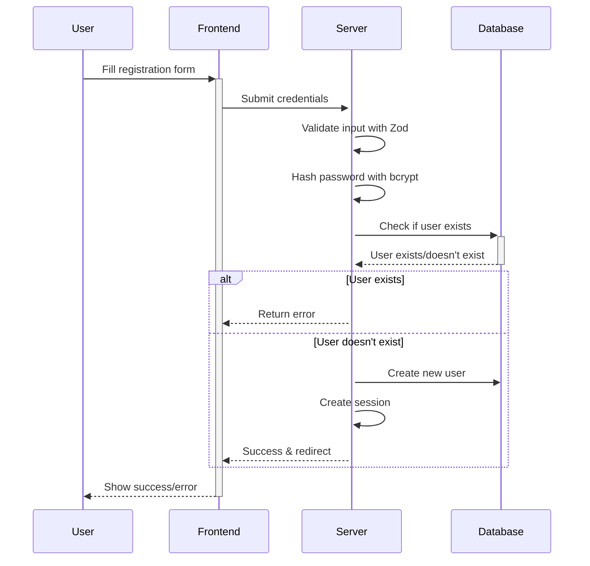

# Next.js 15 + NextAuth v5 Starter Kit 🚀

<div align="center">

[](https://nextjs.org/)
[](https://www.typescriptlang.org/)
[](https://tailwindcss.com/)
[](https://authjs.dev/)
[](https://orm.drizzle.team/)
[](https://playwright.dev/)

</div>

<div align="center">
  <p>A production-ready, feature-complete authentication starter kit with modern best practices.</p>
</div>

<hr />

## ✨ Features

<div align="center">
  <table>
    <tr>
      <td align="center">🔐 <b>Authentication</b></td>
      <td align="center">🛠️ <b>Development</b></td>
      <td align="center">🧪 <b>Testing</b></td>
    </tr>
    <tr>
      <td>
        <ul>
          <li>NextAuth v5 Integration</li>
          <li>Email/Password Authentication</li>
          <li>Secure Session Management</li>
          <li>Protected Routes</li>
          <li>Sign In/Sign Out Flow</li>
        </ul>
      </td>
      <td>
        <ul>
          <li>Next.js 15 App Router</li>
          <li>TypeScript for Type Safety</li>
          <li>Server Actions</li>
          <li>Drizzle ORM with PostgreSQL</li>
          <li>Tailwind CSS</li>
        </ul>
      </td>
      <td>
        <ul>
          <li>Playwright E2E Tests</li>
          <li>Page Object Model Pattern</li>
          <li>Auth Flow Testing</li>
          <li>Visual Testing UI</li>
          <li>Test Coverage</li>
        </ul>
      </td>
    </tr>
  </table>
</div>

## 📚 Table of Contents

- [Quick Start](#-quick-start)
- [Project Structure](#-project-structure)
- [Authentication System](#-authentication-system)
- [Database Setup](#-database-setup)
- [Running Tests](#-running-tests)
- [Deployment](#-deployment)
- [Learn More](#-learn-more)

## 🚀 Quick Start

### Prerequisites

- **Node.js** (18.17.0 or later)
- **PostgreSQL** database

### Step 1: Clone & Install

```bash
# Clone the repository
git clone https://github.com/your-username/next15-nextauth-boilerplate.git

# Navigate to the project
cd next15-nextauth-boilerplate

# Install dependencies
npm install
```

### Step 2: Environment Setup

Create a `.env.local` file in the root directory:

```
# Required environment variables
AUTH_SECRET=your-auth-secret
POSTGRES_URL=your-postgres-url
```

Generate a secure AUTH_SECRET:

```bash
openssl rand -base64 32
```

### Step 3: Database Setup

```bash
# Generate database migrations
npm run db:generate

# Run migrations
npm run db:migrate
```

### Step 4: Start Development Server

```bash
npm run dev
```

Visit [http://localhost:3000](http://localhost:3000) to see your application running.

## 📂 Project Structure

```
next15-nextauth-boilerplate/
│
├── 🗂️ app/                      # Next.js App Router
│   ├── (auth)/                 # Authentication routes
│   │   ├── auth.config.ts      # NextAuth configuration
│   │   ├── auth.ts             # Auth setup and providers
│   │   ├── actions.ts          # Server actions (login/register)
│   │   ├── login/              # Login page
│   │   └── register/           # Registration page
│   │
│   └── (dashboard)/            # Protected routes
│       ├── layout.tsx          # Dashboard layout
│       └── page.tsx            # Dashboard home
│
├── 🧩 components/               # Reusable React components
│   ├── auth-form.tsx           # Authentication form
│   ├── sign-out-form.tsx       # Sign out component
│   └── ui/                     # UI components
│
├── 📊 lib/                      # Utilities and libraries
│   └── db/                     # Database utilities
│       ├── schema.ts           # Drizzle schema definition
│       ├── queries.ts          # Database operations
│       └── migrations/         # Generated migrations
│
├── 🧪 tests/                    # Test files
│   ├── auth.setup.ts           # Authentication test setup
│   ├── auth.test.ts            # Auth flow tests
│   └── dashboard.test.ts       # Dashboard tests
│
├── 🔧 middleware.ts             # NextAuth middleware
├── ⚙️ drizzle.config.ts         # Drizzle ORM configuration
├── 🎭 playwright.config.ts      # Playwright test configuration
└── 📝 README.md                 # You are here!
```

## 🔐 Authentication System

This starter kit implements a complete authentication system using NextAuth v5 with email/password authentication.

### 📋 Authentication Flow

<div align="center">
  
</div>

#### 1️⃣ Registration Process



#### 2️⃣ Login Process

- User submits credentials via login form
- Server validates the input
- Server checks credentials against database
- If valid, a session is created and user is redirected
- If invalid, an error message is displayed

#### 3️⃣ Protected Routes

The middleware protects routes by:
- Checking for valid session
- Redirecting unauthenticated users to login
- Redirecting authenticated users away from auth pages

#### 4️⃣ Sign Out

- User clicks "Sign out" button
- Session is destroyed
- User is redirected to login page

### 🛠️ Key Authentication Files

| File | Purpose |
|------|---------|
| `auth.config.ts` | Core NextAuth configuration |
| `auth.ts` | NextAuth setup with providers |
| `actions.ts` | Server actions for auth operations |
| `middleware.ts` | Route protection |

## 💾 Database Setup

This starter uses **Drizzle ORM** with PostgreSQL for type-safe database access.

### 📊 Database Schema

```typescript
// lib/db/schema.ts
export const user = pgTable('User', {
  id: uuid('id').primaryKey().notNull().defaultRandom(),
  email: varchar('email', { length: 64 }).notNull(),
  password: varchar('password', { length: 64 }),
});
```

### 🔍 Database Operations

The starter includes two main database operations:

1. **Creating users** - Securely hashes passwords before storage:
   ```typescript
   export async function createUser(email: string, password: string)
   ```

2. **Retrieving users** - Finds users by email for authentication:
   ```typescript
   export async function getUser(email: string): Promise<Array<User>>
   ```

### 🔄 Migrations

Database migrations are handled automatically:

```bash
# Generate migrations after schema changes
npm run db:generate

# Apply migrations to your database
npm run db:migrate
```

## 🧪 Running Tests

This starter includes comprehensive end-to-end tests with Playwright.

### 🧩 Test Structure

Tests are organized using the Page Object Model pattern for better maintainability:

```typescript
// Example of AuthPage class
class AuthPage {
  constructor(private page: Page) {}
  
  async login(email: string, password: string) {
    await this.gotoLogin();
    await this.page.getByLabel('Email Address').fill(email);
    await this.page.getByLabel('Password').fill(password);
    await this.page.getByRole('button', { name: 'Sign In' }).click();
  }
  
  // Other authentication methods...
}
```

### 🚦 Running the Test Suite

```bash
# Install Playwright browsers (first time only)
npx playwright install

# Run all tests
npm run test

# Run tests with visual UI
npm run test:ui
```

### 📋 What's Tested

<div align="center">
  <table>
    <tr>
      <th>Feature</th>
      <th>Tests</th>
    </tr>
    <tr>
      <td>Registration</td>
      <td>
        ✅ New user registration<br>
        ✅ Existing email validation<br>
        ✅ Password requirements
      </td>
    </tr>
    <tr>
      <td>Login</td>
      <td>
        ✅ Valid credentials<br>
        ✅ Invalid credentials<br>
        ✅ Form validation
      </td>
    </tr>
    <tr>
      <td>Protected Routes</td>
      <td>
        ✅ Authenticated access<br>
        ✅ Unauthenticated redirects
      </td>
    </tr>
    <tr>
      <td>Dashboard</td>
      <td>
        ✅ User info display<br>
        ✅ Sign out functionality
      </td>
    </tr>
  </table>
</div>

## 🚀 Deployment

### Vercel Deployment (Recommended)

<div align="center">
  <a href="https://vercel.com/new/clone?repository-url=https%3A%2F%2Fgithub.com%2Fyour-username%2Fnext15-nextauth-boilerplate">
    
  </a>
</div>

1. Push your code to GitHub, GitLab, or Bitbucket
2. Import the project on Vercel
3. Configure your environment variables:
   - `AUTH_SECRET`
   - `POSTGRES_URL`
4. Deploy!

### Alternative Hosting

For other hosting providers, ensure you:

1. Build the application with `npm run build`
2. Set up the required environment variables
3. Configure your database connection
4. Deploy the built application

## 📚 Learn More

<div align="center">
  <table>
    <tr>
      <td align="center" width="33%">
        <br>
        <a href="https://nextjs.org/docs">Next.js</a>
      </td>
      <td align="center" width="33%">
        <br>
        <a href="https://authjs.dev/">NextAuth</a>
      </td>
      <td align="center" width="33%">
        <br>
        <a href="https://orm.drizzle.team/">Drizzle ORM</a>
      </td>
    </tr>
    <tr>
      <td align="center">
        <br>
        <a href="https://playwright.dev/">Playwright</a>
      </td>
      <td align="center">
        <br>
        <a href="https://tailwindcss.com/docs">Tailwind CSS</a>
      </td>
      <td align="center">
        <br>
        <a href="https://www.typescriptlang.org/docs/">TypeScript</a>
      </td>
    </tr>
  </table>
</div>

---

<div align="center">
  <p>Made with ❤️ for Next.js developers</p>
  <p>MIT License</p>
</div>
# nextjs15-postgres-nextauth-tailwindcss-template
